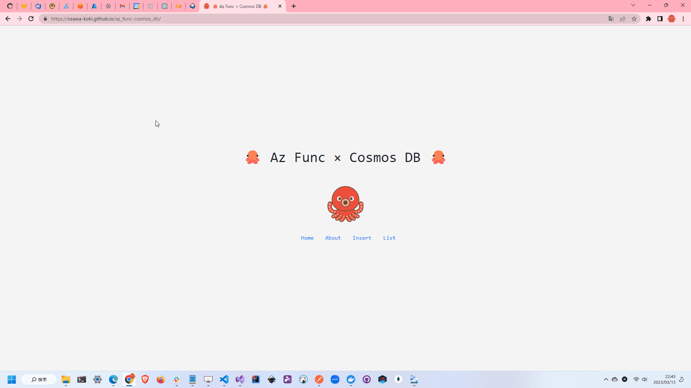

# az_func-cosmos_db

🦉🦉🦉 `Azure Function` + `Cosmos DB`でWEBサービスを構築するサンプルです。  
`Terraform`でAzure上にリソースを構築し、`GitHub Actions`でAzure上のリソースをデプロイします。  

ここでは、簡単なデモとしてユーザの登録・取得・削除・参照を行うAPIを作成しています。  

  

## 使用している技術

- Azure
  - Azure Functions
  - Cosmos DB (MongoDB)
  - Azure Storage Account
  - Azure App Service
- Terraform
  - Backend Service
- GitHub
  - Repository
  - GitHub Actions
  - GitHub Pages
- .NET6.0
  - C#
- Next.js
  - React
  - TypeScript

インフラはTerraformで構築しています。  
これはAzure Blob Storageを使用したバックエンドサービスになっています。  
GitHub ActionsでTerraformのコマンドを実行しています。  

サーバサイドはAzure Functionsで構築しています。  
これもGitHub Actionsでデプロイしています。  

フロントエンドはNext.jsで構築しています。  
GitHub Pagesでホスティングしています。  

## 準備

以下のGitHubシークレットを設定します。  

| シークレット名 | 説明 |
| --- | --- |
| AZURE_STORAGE_ACCESS_KEY | Azure Storage Accountのアクセスキー |
| STORAGRE_ACOUNT_NAME | Azure Storage Accountのアカウント名 (バックエンドサービス) / 事前に作成する必要があります。 |
| CONTAINER_NAME | Azure Storage Accountのコンテナ名 (バックエンドサービス) / 事前に作成する必要があります。 |
| TFVARS | Terraformの変数ファイルの内容 (`terraform.tfvars`) |
| AZURE_RESOURCE_GROUP | Azure上のリソースグループ名 (`terraform.tfvars`の`project_name`) |
| AZURE_FUNCTIONAPP_NAME | Azure上のFunction App名 (`terraform.tfvars`の`function_app_name`) |
| AZURE_CREDENTIALS | AzureのサービスプリンシパルのJSON |

### Azure CLIのインストール

Azure CLIをインストールします。  
[Install Azure CLI | Microsoft Docs](https://docs.microsoft.com/ja-jp/cli/azure/install-azure-cli)  

以下のコマンドでログインします。  

```shell
az login
```

ログインが完了したら、サービスプリンシパルを作成します。  
[参考](https://github.com/marketplace/actions/azure-cli-action#configure-azure-credentials-as-github-secret)  

```shell
az ad sp create-for-rbac --name "★プリンシパル名★" --role contributor  --scopes /subscriptions/★サブスクリプションID★ --sdk-auth
```

これで出力されたJSONの中から以下の値を取得します。  

| シークレット名 | 説明 |
| --- | --- |
| client_id | クライアントID |
| client_secret | クライアントシークレット |
| subscription_id | サブスクリプションID |
| tenant_id | テナントID |

これらを`terraform.tfvars`に記載します。  
また、このJSON全体を`AZURE_CREDENTIALS`という名前でGitHubシークレットに設定します。  

## 参考文献

- [GitHub Actionsを使用した継続的デリバリー](https://learn.microsoft.com/ja-jp/azure/azure-functions/functions-how-to-github-actions?tabs=dotnet)
